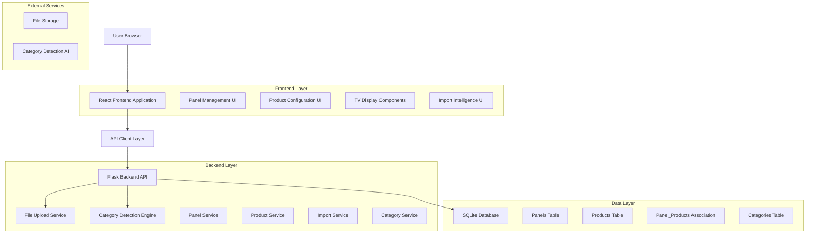
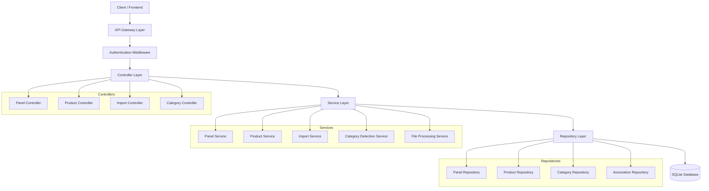
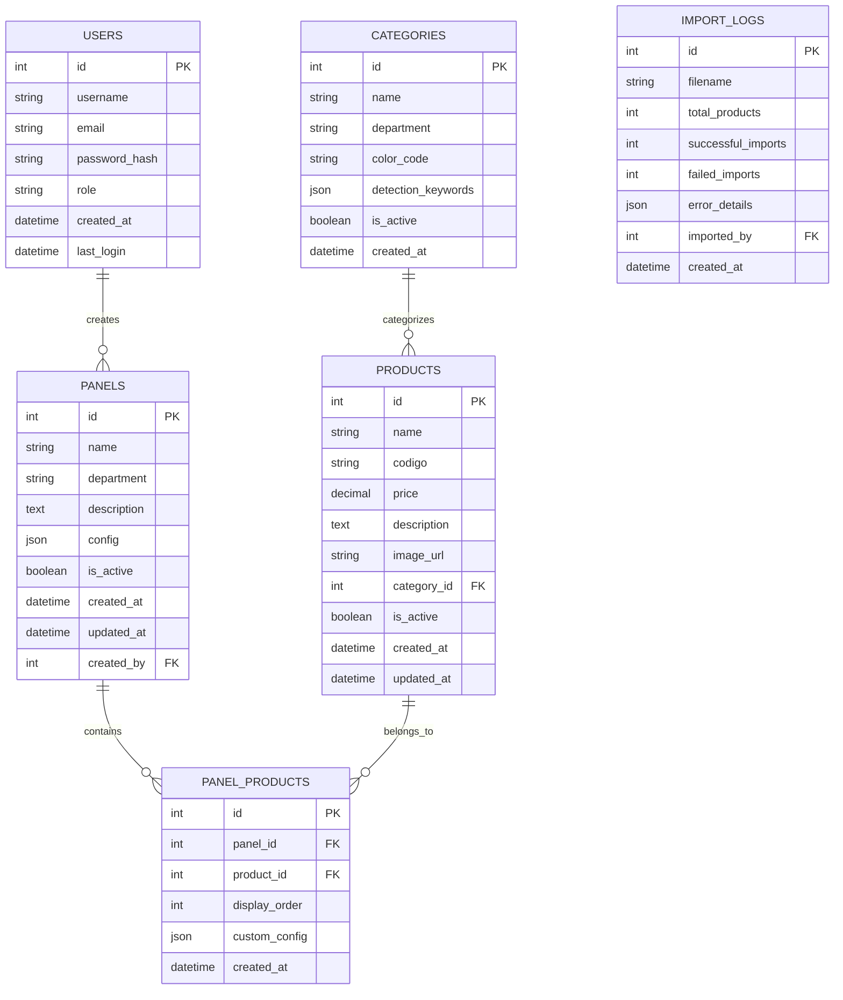

# Arquitetura Técnica - Sistema de Múltiplos Painéis Segmentados

## 1. Architecture design



## 2. Technology Description

- **Frontend**: React@18 + TypeScript + TailwindCSS@3 + Vite + React Router + React Query
- **Backend**: Flask@2.3 + SQLAlchemy + Flask-CORS + Flask-JWT-Extended
- **Database**: SQLite (desenvolvimento) / PostgreSQL (produção)
- **File Processing**: Python pandas + openpyxl para processamento de arquivos
- **State Management**: React Query + Context API
- **UI Components**: Headless UI + Lucide React Icons

## 3. Route definitions

| Route | Purpose |
|-------|---------|
| / | Dashboard principal com visão geral dos painéis |
| /panels | Gestão de painéis - lista, criar, editar |
| /panels/create | Formulário de criação de novo painel |
| /panels/:id/edit | Edição de painel específico |
| /panels/:id/products | Configuração de produtos do painel |
| /products | Gestão de produtos com categorização |
| /products/import | Interface de importação inteligente |
| /tv-selector | Modal/página de seleção de painéis para TV |
| /tv/:panelId | Visualização específica do painel TV |
| /settings/panels | Configurações avançadas de painéis |
| /settings/categories | Gestão de categorias e departamentos |

## 4. API definitions

### 4.1 Core API

**Gestão de Painéis**

```
GET /api/panels
```
Response:
| Param Name | Param Type | Description |
|------------|------------|-------------|
| panels | array | Lista de painéis com informações básicas |
| total | number | Total de painéis cadastrados |

```
POST /api/panels
```
Request:
| Param Name | Param Type | isRequired | Description |
|------------|------------|------------|-------------|
| name | string | true | Nome do painel |
| department | string | true | Departamento (açougue, padaria, hortifruti) |
| description | string | false | Descrição do painel |
| config | object | false | Configurações específicas do painel |
| is_active | boolean | false | Status ativo/inativo (padrão: true) |

```
PUT /api/panels/:id
```
Request: Mesmos parâmetros do POST

```
DELETE /api/panels/:id
```
Response:
| Param Name | Param Type | Description |
|------------|------------|-------------|
| success | boolean | Status da operação |
| message | string | Mensagem de confirmação |

**Gestão de Produtos**

```
GET /api/products
```
Query Parameters:
| Param Name | Param Type | isRequired | Description |
|------------|------------|------------|-------------|
| department | string | false | Filtrar por departamento |
| panel_id | number | false | Filtrar por painel |
| page | number | false | Paginação |
| limit | number | false | Itens por página |

```
POST /api/products/:id/assign-panel
```
Request:
| Param Name | Param Type | isRequired | Description |
|------------|------------|------------|-------------|
| panel_id | number | true | ID do painel para associar |

```
POST /api/products/import
```
Request (multipart/form-data):
| Param Name | Param Type | isRequired | Description |
|------------|------------|------------|-------------|
| file | file | true | Arquivo TXT/JSON para importação |
| auto_categorize | boolean | false | Ativar categorização automática |
| default_panel | number | false | Painel padrão para produtos sem categoria |

**Categorização Inteligente**

```
POST /api/categories/detect
```
Request:
| Param Name | Param Type | isRequired | Description |
|------------|------------|------------|-------------|
| product_name | string | true | Nome do produto para análise |
| description | string | false | Descrição adicional |

Response:
| Param Name | Param Type | Description |
|------------|------------|-------------|
| category | string | Categoria detectada |
| confidence | number | Nível de confiança (0-1) |
| suggestions | array | Categorias alternativas |

**Visualização de Painéis TV**

```
GET /api/panels/:id/display
```
Response:
| Param Name | Param Type | Description |
|------------|------------|-------------|
| panel | object | Informações do painel |
| products | array | Produtos associados ao painel |
| config | object | Configurações de exibição |
| last_updated | string | Última atualização dos dados |

## 5. Server architecture diagram



## 6. Data model

### 6.1 Data model definition



### 6.2 Data Definition Language

**Tabela de Painéis (panels)**
```sql
-- Criar tabela de painéis
CREATE TABLE panels (
    id INTEGER PRIMARY KEY AUTOINCREMENT,
    name VARCHAR(100) NOT NULL,
    department VARCHAR(50) NOT NULL CHECK (department IN ('açougue', 'padaria', 'hortifruti', 'geral')),
    description TEXT,
    config JSON DEFAULT '{}',
    is_active BOOLEAN DEFAULT TRUE,
    created_at TIMESTAMP DEFAULT CURRENT_TIMESTAMP,
    updated_at TIMESTAMP DEFAULT CURRENT_TIMESTAMP,
    created_by INTEGER,
    FOREIGN KEY (created_by) REFERENCES users(id)
);

-- Índices para performance
CREATE INDEX idx_panels_department ON panels(department);
CREATE INDEX idx_panels_active ON panels(is_active);
CREATE INDEX idx_panels_created_at ON panels(created_at DESC);
```

**Tabela de Categorias (categories)**
```sql
-- Criar tabela de categorias
CREATE TABLE categories (
    id INTEGER PRIMARY KEY AUTOINCREMENT,
    name VARCHAR(100) NOT NULL,
    department VARCHAR(50) NOT NULL,
    color_code VARCHAR(7) DEFAULT '#6b7280',
    detection_keywords JSON DEFAULT '[]',
    is_active BOOLEAN DEFAULT TRUE,
    created_at TIMESTAMP DEFAULT CURRENT_TIMESTAMP
);

-- Índices
CREATE INDEX idx_categories_department ON categories(department);
CREATE INDEX idx_categories_active ON categories(is_active);

-- Dados iniciais de categorias
INSERT INTO categories (name, department, color_code, detection_keywords) VALUES
('Carnes Bovinas', 'açougue', '#dc2626', '["carne", "boi", "bovino", "alcatra", "picanha", "maminha"]'),
('Carnes Suínas', 'açougue', '#dc2626', '["porco", "suíno", "lombo", "costela", "bacon"]'),
('Aves', 'açougue', '#dc2626', '["frango", "galinha", "ave", "peito", "coxa", "asa"]'),
('Pães', 'padaria', '#f97316', '["pão", "pães", "baguete", "francês", "integral"]'),
('Doces', 'padaria', '#f97316', '["doce", "bolo", "torta", "brigadeiro", "pudim"]'),
('Salgados', 'padaria', '#f97316', '["salgado", "coxinha", "pastel", "empada", "quiche"]'),
('Frutas', 'hortifruti', '#16a34a', '["fruta", "maçã", "banana", "laranja", "uva", "manga"]'),
('Verduras', 'hortifruti', '#16a34a', '["verdura", "alface", "couve", "espinafre", "rúcula"]'),
('Legumes', 'hortifruti', '#16a34a', '["legume", "tomate", "cebola", "batata", "cenoura"]');
```

**Atualização da Tabela de Produtos**
```sql
-- Adicionar coluna de categoria aos produtos existentes
ALTER TABLE products ADD COLUMN category_id INTEGER;
ALTER TABLE products ADD COLUMN department VARCHAR(50);

-- Criar foreign key para categoria
-- (SQLite não suporta ADD CONSTRAINT, então recriar a tabela se necessário)

-- Índices adicionais
CREATE INDEX idx_products_category ON products(category_id);
CREATE INDEX idx_products_department ON products(department);
CREATE INDEX idx_products_active ON products(is_active);
```

**Tabela de Associação Painel-Produtos (panel_products)**
```sql
-- Criar tabela de associação many-to-many
CREATE TABLE panel_products (
    id INTEGER PRIMARY KEY AUTOINCREMENT,
    panel_id INTEGER NOT NULL,
    product_id INTEGER NOT NULL,
    display_order INTEGER DEFAULT 0,
    custom_config JSON DEFAULT '{}',
    created_at TIMESTAMP DEFAULT CURRENT_TIMESTAMP,
    FOREIGN KEY (panel_id) REFERENCES panels(id) ON DELETE CASCADE,
    FOREIGN KEY (product_id) REFERENCES products(id) ON DELETE CASCADE,
    UNIQUE(panel_id, product_id)
);

-- Índices para performance
CREATE INDEX idx_panel_products_panel ON panel_products(panel_id);
CREATE INDEX idx_panel_products_product ON panel_products(product_id);
CREATE INDEX idx_panel_products_order ON panel_products(panel_id, display_order);
```

**Tabela de Logs de Importação (import_logs)**
```sql
-- Criar tabela de logs de importação
CREATE TABLE import_logs (
    id INTEGER PRIMARY KEY AUTOINCREMENT,
    filename VARCHAR(255) NOT NULL,
    total_products INTEGER DEFAULT 0,
    successful_imports INTEGER DEFAULT 0,
    failed_imports INTEGER DEFAULT 0,
    error_details JSON DEFAULT '[]',
    imported_by INTEGER,
    created_at TIMESTAMP DEFAULT CURRENT_TIMESTAMP,
    FOREIGN KEY (imported_by) REFERENCES users(id)
);

-- Índices
CREATE INDEX idx_import_logs_date ON import_logs(created_at DESC);
CREATE INDEX idx_import_logs_user ON import_logs(imported_by);
```

**Script de Migração para Dados Existentes**
```sql
-- Migrar produtos existentes para o novo sistema
-- 1. Criar categoria padrão para produtos sem categoria
INSERT INTO categories (name, department, color_code) 
VALUES ('Sem Categoria', 'geral', '#6b7280');

-- 2. Atribuir categoria padrão aos produtos existentes
UPDATE products 
SET category_id = (SELECT id FROM categories WHERE name = 'Sem Categoria' LIMIT 1),
    department = 'geral'
WHERE category_id IS NULL;

-- 3. Criar painel padrão para migração
INSERT INTO panels (name, department, description, is_active)
VALUES ('Painel Principal', 'geral', 'Painel principal com todos os produtos (migração)', TRUE);

-- 4. Associar todos os produtos existentes ao painel padrão
INSERT INTO panel_products (panel_id, product_id, display_order)
SELECT 
    (SELECT id FROM panels WHERE name = 'Painel Principal' LIMIT 1),
    id,
    ROW_NUMBER() OVER (ORDER BY id)
FROM products 
WHERE is_active = TRUE;
```