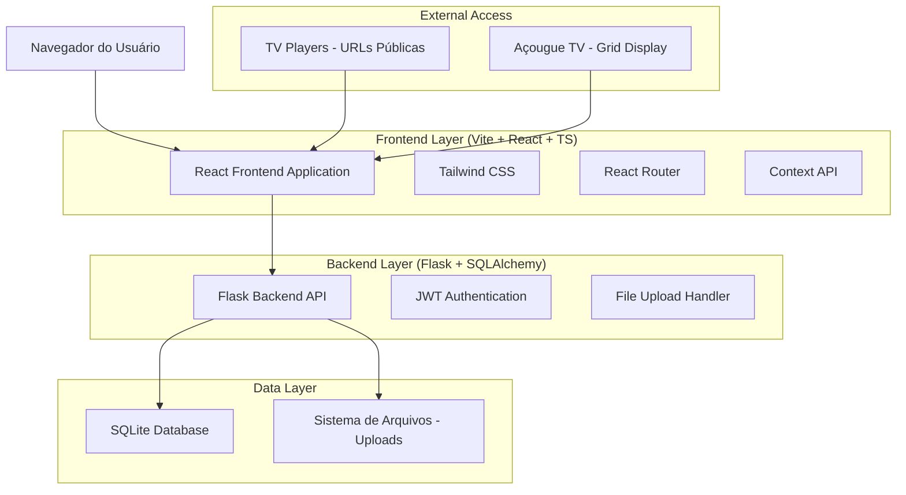
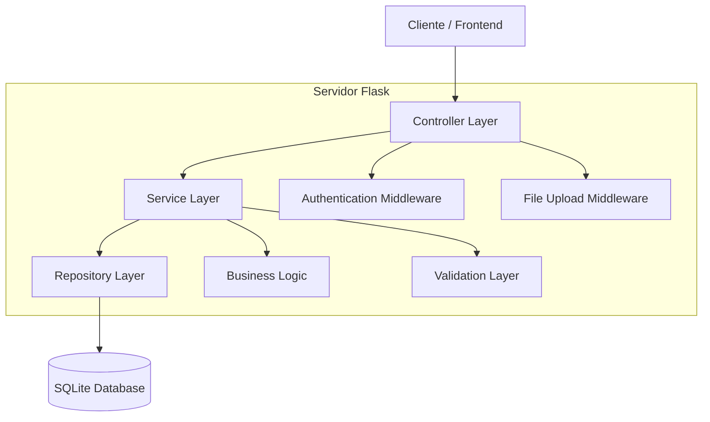
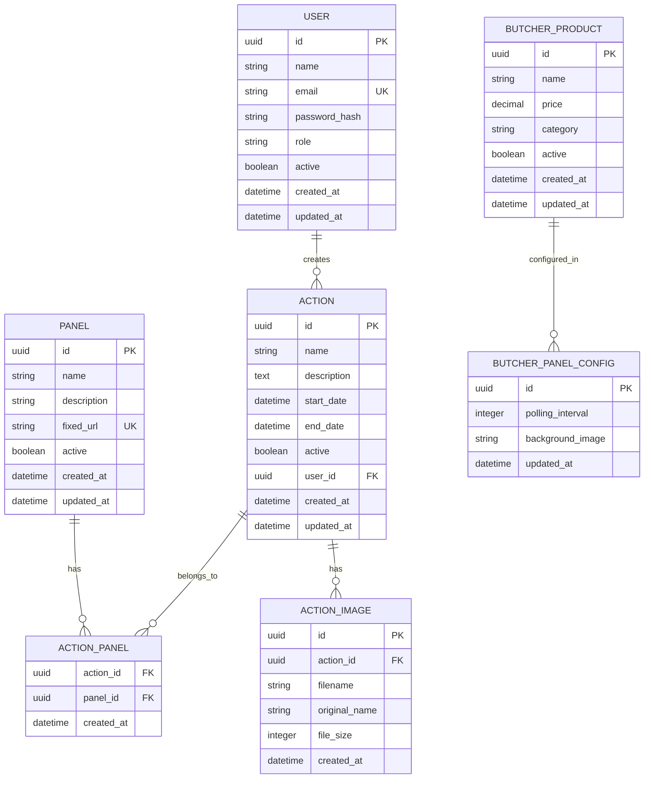

# Arquitetura Técnica - Sistema de Painéis TV

## 1. Arquitetura do Sistema



## 2. Descrição das Tecnologias

- **Frontend**: React@18 + TypeScript + Tailwind CSS + Vite
- **Backend**: Flask + SQLAlchemy + JWT Authentication
- **Database**: SQLite (desenvolvimento) / PostgreSQL (produção)
- **Upload**: Sistema de arquivos local com validação
- **Autenticação**: JWT com refresh tokens
- **Roteamento**: React Router DOM v6

## 3. Definições de Rotas

### 3.1 Rotas Frontend

| Rota | Propósito |
|------|-----------|
| `/` | Dashboard principal com estatísticas e navegação |
| `/auth/login` | Página de login com validação |
| `/auth/register` | Registro de novos usuários (admin only) |
| `/auth/forgot-password` | Recuperação de senha via email |
| `/panels` | Listagem e gerenciamento de painéis |
| `/panels/create` | Formulário de criação de painel |
| `/panels/:id/edit` | Edição de painel específico |
| `/actions` | Listagem e gerenciamento de ações |
| `/actions/create` | Formulário de criação de ação |
| `/actions/:id/edit` | Edição de ação específica |
| `/users` | Gerenciamento de usuários (admin only) |
| `/users/create` | Criação de novo usuário |
| `/users/:id/edit` | Edição de usuário específico |
| `/acougue/admin` | Painel administrativo do açougue |
| `/acougue/tv` | Exibição pública do açougue (TV) |
| `/player/:fixedUrl` | Player público para painéis de TV |
| `/profile` | Perfil do usuário logado |
| `/settings` | Configurações do sistema |

### 3.2 Rotas Protegidas vs Públicas

**Rotas Públicas:**
- `/auth/*` - Todas as rotas de autenticação
- `/player/:fixedUrl` - Player de TV
- `/acougue/tv` - Display do açougue

**Rotas Protegidas (requer login):**
- `/` - Dashboard
- `/panels/*` - Gerenciamento de painéis
- `/actions/*` - Gerenciamento de ações
- `/profile` - Perfil do usuário
- `/settings` - Configurações

**Rotas Admin (requer papel admin):**
- `/users/*` - Gerenciamento de usuários
- `/acougue/admin` - Administração do açougue

## 4. Definições de API

### 4.1 Autenticação

**Login de usuário**
```
POST /api/auth/login
```

Request:
| Parâmetro | Tipo | Obrigatório | Descrição |
|-----------|------|-------------|-----------|
| email | string | true | Email do usuário |
| password | string | true | Senha em texto plano |

Response:
| Parâmetro | Tipo | Descrição |
|-----------|------|-----------|
| token | string | JWT token para autenticação |
| user | object | Dados do usuário logado |
| expires_in | number | Tempo de expiração do token em segundos |

Exemplo:
```json
{
  "token": "eyJhbGciOiJIUzI1NiIsInR5cCI6IkpXVCJ9...",
  "user": {
    "id": "uuid-123",
    "name": "João Silva",
    "email": "joao@email.com",
    "role": "admin"
  },
  "expires_in": 3600
}
```

**Registro de usuário**
```
POST /api/auth/register
```

Request:
| Parâmetro | Tipo | Obrigatório | Descrição |
|-----------|------|-------------|-----------|
| name | string | true | Nome completo do usuário |
| email | string | true | Email único do usuário |
| password | string | true | Senha (mínimo 6 caracteres) |
| role | string | false | Papel do usuário (default: 'user') |

**Verificação de usuário atual**
```
GET /api/auth/me
```
Headers: `Authorization: Bearer <token>`

### 4.2 Gerenciamento de Usuários

**Listar usuários**
```
GET /api/users
```
Headers: `Authorization: Bearer <token>` (admin only)

Query Parameters:
| Parâmetro | Tipo | Descrição |
|-----------|------|-----------|
| page | number | Página atual (default: 1) |
| limit | number | Itens por página (default: 10) |
| search | string | Busca por nome ou email |
| role | string | Filtrar por papel |
| active | boolean | Filtrar por status ativo |

**Criar usuário**
```
POST /api/users
```
Headers: `Authorization: Bearer <token>` (admin only)

**Atualizar usuário**
```
PUT /api/users/:id
```
Headers: `Authorization: Bearer <token>` (admin only)

**Excluir usuário**
```
DELETE /api/users/:id
```
Headers: `Authorization: Bearer <token>` (admin only)

### 4.3 Gerenciamento de Painéis

**Listar painéis**
```
GET /api/panels
```
Headers: `Authorization: Bearer <token>`

**Criar painel**
```
POST /api/panels
```

Request:
| Parâmetro | Tipo | Obrigatório | Descrição |
|-----------|------|-------------|-----------|
| name | string | true | Nome do painel |
| description | string | false | Descrição do painel |
| active | boolean | false | Status ativo (default: true) |

**Player do painel**
```
GET /api/player/:fixedUrl
```
Rota pública que retorna ações ativas do painel

### 4.4 Gerenciamento de Ações

**Listar ações**
```
GET /api/actions
```
Headers: `Authorization: Bearer <token>`

**Criar ação**
```
POST /api/actions
```

**Upload de imagens da ação**
```
POST /api/actions/:id/images
```
Content-Type: `multipart/form-data`

**Associar ação a painéis**
```
POST /api/actions/:id/panels
```

Request:
| Parâmetro | Tipo | Descrição |
|-----------|------|-----------|
| panel_ids | array | Array de IDs dos painéis |

### 4.5 Açougue

**Listar produtos do açougue**
```
GET /api/acougue
```
Rota pública para TV

**Gerenciar produtos (Admin)**
```
GET /api/acougue/admin
POST /api/acougue/admin
PUT /api/acougue/admin/:id
DELETE /api/acougue/admin/:id
```
Headers: `Authorization: Bearer <token>` (admin only)

## 5. Arquitetura do Servidor



### 5.1 Camadas do Sistema

- **Controller Layer**: Rotas Flask que recebem requests HTTP
- **Authentication Middleware**: Validação de JWT e autorização
- **Service Layer**: Lógica de negócio e validações
- **Repository Layer**: Acesso aos dados via SQLAlchemy
- **File Upload Middleware**: Processamento de uploads de imagem

## 6. Modelo de Dados

### 6.1 Diagrama Entidade-Relacionamento



### 6.2 Definições DDL

**Tabela de Usuários**
```sql
-- Criar tabela de usuários
CREATE TABLE users (
    id UUID PRIMARY KEY DEFAULT gen_random_uuid(),
    name VARCHAR(100) NOT NULL,
    email VARCHAR(255) UNIQUE NOT NULL,
    password_hash VARCHAR(255) NOT NULL,
    role VARCHAR(20) DEFAULT 'user' CHECK (role IN ('admin', 'user')),
    active BOOLEAN DEFAULT true,
    created_at TIMESTAMP WITH TIME ZONE DEFAULT NOW(),
    updated_at TIMESTAMP WITH TIME ZONE DEFAULT NOW()
);

-- Índices
CREATE INDEX idx_users_email ON users(email);
CREATE INDEX idx_users_role ON users(role);
CREATE INDEX idx_users_active ON users(active);

-- Dados iniciais
INSERT INTO users (name, email, password_hash, role) VALUES 
('Administrador', 'admin@sistema.com', 'hash_da_senha', 'admin');
```

**Tabela de Painéis**
```sql
-- Criar tabela de painéis
CREATE TABLE panels (
    id UUID PRIMARY KEY DEFAULT gen_random_uuid(),
    name VARCHAR(100) NOT NULL,
    description TEXT,
    fixed_url VARCHAR(50) UNIQUE NOT NULL,
    active BOOLEAN DEFAULT true,
    created_at TIMESTAMP WITH TIME ZONE DEFAULT NOW(),
    updated_at TIMESTAMP WITH TIME ZONE DEFAULT NOW()
);

-- Índices
CREATE INDEX idx_panels_fixed_url ON panels(fixed_url);
CREATE INDEX idx_panels_active ON panels(active);
```

**Tabela de Ações**
```sql
-- Criar tabela de ações
CREATE TABLE actions (
    id UUID PRIMARY KEY DEFAULT gen_random_uuid(),
    name VARCHAR(100) NOT NULL,
    description TEXT,
    start_date TIMESTAMP WITH TIME ZONE NOT NULL,
    end_date TIMESTAMP WITH TIME ZONE NOT NULL,
    active BOOLEAN DEFAULT true,
    user_id UUID REFERENCES users(id) ON DELETE SET NULL,
    created_at TIMESTAMP WITH TIME ZONE DEFAULT NOW(),
    updated_at TIMESTAMP WITH TIME ZONE DEFAULT NOW()
);

-- Índices
CREATE INDEX idx_actions_user_id ON actions(user_id);
CREATE INDEX idx_actions_dates ON actions(start_date, end_date);
CREATE INDEX idx_actions_active ON actions(active);
```

**Tabela de Relacionamento Ação-Painel**
```sql
-- Criar tabela de relacionamento ação-painel
CREATE TABLE action_panels (
    action_id UUID REFERENCES actions(id) ON DELETE CASCADE,
    panel_id UUID REFERENCES panels(id) ON DELETE CASCADE,
    created_at TIMESTAMP WITH TIME ZONE DEFAULT NOW(),
    PRIMARY KEY (action_id, panel_id)
);
```

**Tabela de Imagens das Ações**
```sql
-- Criar tabela de imagens das ações
CREATE TABLE action_images (
    id UUID PRIMARY KEY DEFAULT gen_random_uuid(),
    action_id UUID REFERENCES actions(id) ON DELETE CASCADE,
    filename VARCHAR(255) NOT NULL,
    original_name VARCHAR(255) NOT NULL,
    file_size INTEGER NOT NULL,
    created_at TIMESTAMP WITH TIME ZONE DEFAULT NOW()
);

-- Índices
CREATE INDEX idx_action_images_action_id ON action_images(action_id);
```

**Tabela de Produtos do Açougue**
```sql
-- Criar tabela de produtos do açougue
CREATE TABLE butcher_products (
    id UUID PRIMARY KEY DEFAULT gen_random_uuid(),
    name VARCHAR(100) NOT NULL,
    price DECIMAL(10,2) NOT NULL,
    category VARCHAR(50),
    active BOOLEAN DEFAULT true,
    created_at TIMESTAMP WITH TIME ZONE DEFAULT NOW(),
    updated_at TIMESTAMP WITH TIME ZONE DEFAULT NOW()
);

-- Índices
CREATE INDEX idx_butcher_products_category ON butcher_products(category);
CREATE INDEX idx_butcher_products_active ON butcher_products(active);
```

**Tabela de Configurações do Painel do Açougue**
```sql
-- Criar tabela de configurações do açougue
CREATE TABLE butcher_panel_config (
    id UUID PRIMARY KEY DEFAULT gen_random_uuid(),
    polling_interval INTEGER DEFAULT 30,
    background_image VARCHAR(255),
    updated_at TIMESTAMP WITH TIME ZONE DEFAULT NOW()
);

-- Dados iniciais
INSERT INTO butcher_panel_config (polling_interval) VALUES (30);
```