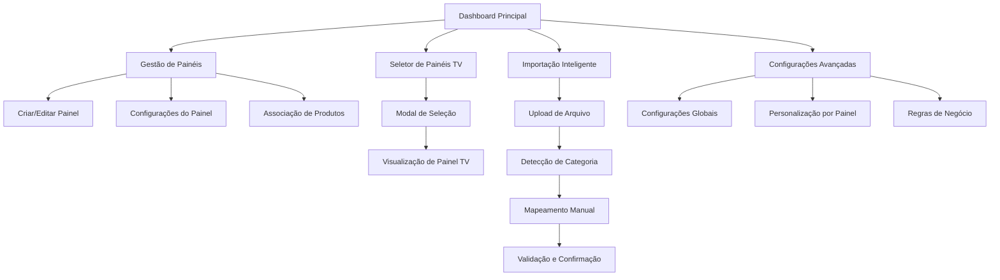

# PRD - Sistema de Múltiplos Painéis Segmentados por Departamento

## 1. Product Overview

Sistema avançado de gestão e exibição de produtos em múltiplos painéis segmentados por departamento, evoluindo do atual painel único para uma solução escalável e flexível que permite administração independente de diferentes setores (açougue, padaria, hortifruti).

O sistema resolve o problema de mistura de produtos de diferentes departamentos em um único painel, oferecendo gestão granular, visualização segmentada e importação inteligente com detecção automática de categorias.

Destinado a estabelecimentos comerciais que necessitam de exibição organizada de produtos por departamento, aumentando a eficiência operacional e melhorando a experiência do cliente.

## 2. Core Features

### 2.1 User Roles

| Role | Registration Method | Core Permissions |
|------|---------------------|------------------|
| Administrador | Login com credenciais existentes | Acesso completo: gestão de painéis, produtos, configurações e visualização |
| Operador | Criado pelo administrador | Visualização de painéis e gestão básica de produtos |

### 2.2 Feature Module

Nosso sistema de múltiplos painéis consiste nas seguintes páginas principais:

1. **Dashboard Principal**: visão geral dos painéis, estatísticas por departamento, acesso rápido às funcionalidades.
2. **Gestão de Painéis**: CRUD completo de painéis, configurações específicas, ativação/desativação.
3. **Configuração de Produtos**: categorização por departamento, associação a painéis, regras de atribuição.
4. **Seletor de Painéis TV**: modal de seleção, preview dos painéis, acesso direto à visualização.
5. **Visualização de Painel TV**: exibição segmentada por departamento, layout personalizado por painel.
6. **Importação Inteligente**: detecção automática de categorias, mapeamento manual, validação de dados.
7. **Configurações Avançadas**: personalização por painel, regras de negócio, preferências do sistema.

### 2.3 Page Details

| Page Name | Module Name | Feature description |
|-----------|-------------|---------------------|
| Dashboard Principal | Visão Geral | Exibir estatísticas de produtos por departamento, status dos painéis ativos, acesso rápido às funcionalidades principais |
| Dashboard Principal | Painéis Ativos | Listar painéis configurados com status (ativo/inativo), contagem de produtos, última atualização |
| Dashboard Principal | Ações Rápidas | Botões para criar novo painel, importar produtos, acessar configurações, visualizar painéis TV |
| Gestão de Painéis | Lista de Painéis | Exibir todos os painéis cadastrados em tabela com nome, departamento, status, quantidade de produtos, ações |
| Gestão de Painéis | Criar/Editar Painel | Formulário com nome do painel, departamento, descrição, configurações de layout, regras de produtos |
| Gestão de Painéis | Configurações do Painel | Personalizar cores, layout, informações exibidas, tempo de rotação, filtros automáticos |
| Gestão de Painéis | Associação de Produtos | Interface para vincular/desvincular produtos específicos ao painel, regras de categoria |
| Configuração de Produtos | Lista de Produtos | Exibir produtos com departamento, painéis associados, status, filtros por categoria |
| Configuração de Produtos | Edição de Categoria | Alterar departamento do produto, definir painéis de exibição, configurar regras específicas |
| Configuração de Produtos | Regras de Atribuição | Configurar regras automáticas para associar produtos a painéis baseado em critérios |
| Seletor de Painéis TV | Modal de Seleção | Exibir grid com painéis disponíveis, preview em miniatura, informações básicas |
| Seletor de Painéis TV | Preview do Painel | Mostrar prévia do painel selecionado, contagem de produtos, última atualização |
| Seletor de Painéis TV | Acesso Direto | Botão para abrir painel em nova aba/janela, opções de visualização (fullscreen, windowed) |
| Visualização de Painel TV | Exibição de Produtos | Mostrar apenas produtos do departamento selecionado, layout personalizado por painel |
| Visualização de Painel TV | Header Personalizado | Exibir nome do painel, departamento, data/hora, logo personalizado se configurado |
| Visualização de Painel TV | Rotação Automática | Sistema de rotação de produtos com tempo configurável por painel |
| Importação Inteligente | Upload de Arquivo | Interface para upload de TXT/JSON, validação de formato, preview dos dados |
| Importação Inteligente | Detecção de Categoria | Algoritmo para detectar departamento automaticamente baseado em palavras-chave |
| Importação Inteligente | Mapeamento Manual | Interface para corrigir categorias detectadas, atribuir produtos a painéis específicos |
| Importação Inteligente | Validação e Confirmação | Revisar dados antes da importação, resolver conflitos, confirmar associações |
| Configurações Avançadas | Configurações Globais | Definir configurações padrão para novos painéis, regras gerais do sistema |
| Configurações Avançadas | Personalização por Painel | Configurar layout, cores, fontes, animações específicas para cada painel |
| Configurações Avançadas | Regras de Negócio | Definir regras automáticas de categorização, filtros, validações |

## 3. Core Process

### Fluxo do Administrador - Gestão de Painéis

1. **Acesso ao Sistema**: Login no dashboard principal
2. **Criação de Painel**: Navegar para Gestão de Painéis → Criar Novo Painel
3. **Configuração**: Definir nome, departamento, layout e regras de produtos
4. **Associação de Produtos**: Configurar quais produtos/categorias aparecem no painel
5. **Ativação**: Ativar o painel para disponibilizar na visualização
6. **Teste**: Usar o Seletor de Painéis TV para verificar funcionamento

### Fluxo do Operador - Visualização de Painéis

1. **Acesso ao Dashboard**: Login e visualização dos painéis disponíveis
2. **Seleção de Painel**: Clicar em "Ver Painel TV" e escolher departamento desejado
3. **Visualização**: Sistema exibe apenas produtos do departamento selecionado
4. **Navegação**: Alternar entre diferentes painéis conforme necessário

### Fluxo de Importação Inteligente

1. **Upload de Arquivo**: Carregar arquivo TXT/JSON com produtos
2. **Detecção Automática**: Sistema identifica categorias baseado em palavras-chave
3. **Revisão Manual**: Corrigir categorizações incorretas se necessário
4. **Atribuição a Painéis**: Sistema associa produtos aos painéis corretos automaticamente
5. **Confirmação**: Revisar e confirmar importação

## 4. User Interface Design

### 4.1 Design Style

- **Cores Primárias**: Azul (#2563eb) para ações principais, Verde (#16a34a) para status ativo
- **Cores Secundárias**: Cinza (#6b7280) para textos secundários, Vermelho (#dc2626) para alertas
- **Estilo de Botões**: Rounded corners (8px), sombras sutis, estados hover/active bem definidos
- **Tipografia**: Inter ou similar, tamanhos 14px (corpo), 16px (subtítulos), 24px (títulos)
- **Layout**: Card-based design, navegação top com breadcrumbs, sidebar para filtros
- **Ícones**: Lucide React ou Heroicons, estilo outline, tamanho 20px padrão
- **Animações**: Transições suaves (300ms), loading states, micro-interações

### 4.2 Page Design Overview

| Page Name | Module Name | UI Elements |
|-----------|-------------|-------------|
| Dashboard Principal | Visão Geral | Cards com estatísticas, gráficos simples, cores por departamento (açougue: vermelho, padaria: laranja, hortifruti: verde) |
| Dashboard Principal | Painéis Ativos | Grid de cards com preview, badges de status, botões de ação rápida |
| Gestão de Painéis | Lista de Painéis | Tabela responsiva, filtros por departamento, ações inline, modal de confirmação para exclusão |
| Gestão de Painéis | Criar/Editar Painel | Formulário em steps, preview em tempo real, validação inline, botões de ação no footer |
| Seletor de Painéis TV | Modal de Seleção | Grid 3x2 com cards grandes, imagens de preview, informações overlay, botão CTA destacado |
| Visualização de Painel TV | Exibição de Produtos | Layout fullscreen, header fixo com branding, grid responsivo de produtos, rotação suave |
| Importação Inteligente | Upload de Arquivo | Drag & drop area, progress bar, preview em tabela, chips para categorias detectadas |
| Configurações Avançadas | Personalização | Tabs para diferentes seções, color picker, sliders para configurações, preview em tempo real |

### 4.3 Responsiveness

O sistema é desktop-first com adaptação mobile completa. A visualização de painéis TV é otimizada para telas grandes (TVs/monitores), enquanto a administração funciona perfeitamente em tablets e smartphones. Touch interactions são otimizadas para dispositivos móveis com botões maiores e gestos intuitivos.