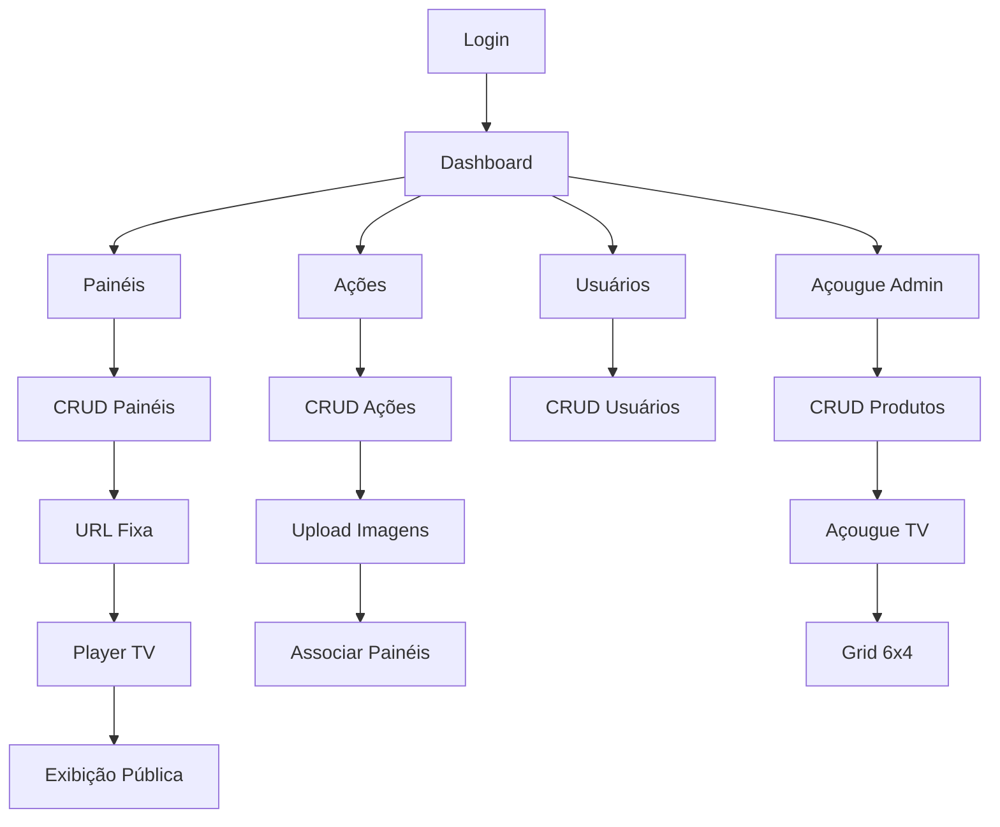

# Sistema de Painéis TV - Documento de Requisitos do Produto

## 1. Visão Geral do Produto

Sistema web para gerenciamento de painéis de TV com exibição de ações/conteúdos dinâmicos e módulo especializado para açougue. O sistema permite criar painéis personalizados, associar ações com imagens, e exibir conteúdo em tempo real em TVs através de URLs fixas. Inclui funcionalidades completas de autenticação e gerenciamento de usuários.

- **Problema a resolver**: Necessidade de exibir conteúdo dinâmico e promocional em TVs de estabelecimentos comerciais de forma centralizada e automatizada.
- **Usuários**: Administradores de estabelecimentos, operadores de conteúdo, e visualização pública em TVs.
- **Valor**: Automatização da comunicação visual, redução de custos com impressão, e atualização em tempo real de promoções e preços.

## 2. Funcionalidades Principais

### 2.1 Papéis de Usuário

| Papel | Método de Registro | Permissões Principais |
|-------|-------------------|----------------------|
| Administrador | Registro inicial ou criação por admin | Acesso completo: CRUD usuários, painéis, ações, configurações |
| Usuário | Criação por administrador | Visualização e operação básica de painéis e ações |

### 2.2 Módulos de Funcionalidade

O sistema de painéis TV consiste nas seguintes páginas principais:

1. **Dashboard**: visão geral, estatísticas de painéis e ações, navegação principal
2. **Gerenciamento de Painéis**: CRUD de painéis, configurações, URLs fixas
3. **Gerenciamento de Ações**: CRUD de ações, upload de imagens, associação com painéis
4. **Player de TV**: exibição pública de conteúdo por URL fixa
5. **Açougue Admin**: gerenciamento de produtos, preços, configurações
6. **Açougue TV**: exibição em grid 6x4 com carrossel de preços
7. **Gerenciamento de Usuários**: CRUD completo de usuários e permissões
8. **Autenticação**: login, registro, recuperação de senha

### 2.3 Detalhes das Páginas

| Página | Módulo | Descrição da Funcionalidade |
|--------|--------|----------------------------|
| Dashboard | Visão Geral | Exibir estatísticas de painéis ativos, ações em execução, resumo de atividades |
| Dashboard | Navegação | Menu principal com acesso a todas as funcionalidades do sistema |
| Painéis | Lista de Painéis | Visualizar todos os painéis cadastrados com status, data de criação, URL fixa |
| Painéis | CRUD Painéis | Criar, editar, ativar/desativar e excluir painéis. Gerar URL fixa única |
| Painéis | Estatísticas | Mostrar número de ações associadas, tempo de atividade, última atualização |
| Ações | Lista de Ações | Visualizar todas as ações com status (ativa/expirada), painéis associados |
| Ações | CRUD Ações | Criar, editar e excluir ações. Definir período de validade e painéis de destino |
| Ações | Upload de Imagens | Fazer upload múltiplo de imagens, visualizar miniaturas, remover imagens |
| Ações | Associação Painéis | Vincular ações a múltiplos painéis simultaneamente |
| Player | Exibição Pública | Mostrar ações ativas do painel via URL fixa, layout responsivo para TV |
| Player | Rotação de Conteúdo | Alternar entre ações ativas automaticamente com transições |
| Açougue Admin | CRUD Produtos | Gerenciar produtos do açougue: nome, preço, categoria, status |
| Açougue Admin | Import/Export | Importar produtos via CSV/Excel, exportar relatórios |
| Açougue Admin | Configurações | Definir intervalo de atualização, upload de imagem de fundo |
| Açougue TV | Grid de Preços | Exibir produtos em grid 6x4 com preços atualizados |
| Açougue TV | Carrossel | Rotação automática de produtos com overlay de informações |
| Usuários | Lista de Usuários | Visualizar todos os usuários com paginação, filtros por status e papel |
| Usuários | CRUD Usuários | Criar, editar, ativar/desativar e excluir usuários |
| Usuários | Gerenciar Permissões | Definir papéis e permissões específicas por usuário |
| Autenticação | Login | Autenticar usuário com email e senha, manter sessão |
| Autenticação | Registro | Cadastrar novos usuários (apenas admin), validação de dados |
| Autenticação | Recuperação | Reset de senha via email, validação de token |

## 3. Fluxo Principal de Processos

### Fluxo do Administrador
1. Login no sistema → Dashboard com visão geral
2. Criar/gerenciar painéis → Definir configurações e gerar URL fixa
3. Criar/gerenciar ações → Upload de imagens e associação com painéis
4. Configurar açougue → Cadastrar produtos e definir layout
5. Gerenciar usuários → Criar contas e definir permissões

### Fluxo do Usuário Regular
1. Login no sistema → Dashboard limitado
2. Visualizar painéis → Acessar painéis permitidos
3. Gerenciar ações → Criar/editar ações nos painéis autorizados

### Fluxo Público (TV)
1. Acesso direto via URL fixa → Player de TV
2. Exibição automática de ações ativas → Rotação de conteúdo
3. Açougue TV → Grid de preços atualizado automaticamente

## 4. Design da Interface

### 4.1 Estilo de Design

- **Cores Primárias**: Gradientes azul/roxo (#3B82F6 → #8B5CF6) para tema claro, gradientes escuros para tema dark
- **Cores Secundárias**: Cinza neutro (#6B7280), verde para sucesso (#10B981), vermelho para alertas (#EF4444)
- **Estilo de Botões**: Arredondados (rounded-lg), com gradientes e efeitos hover suaves
- **Tipografia**: Inter como fonte principal, tamanhos de 14px a 24px conforme hierarquia
- **Layout**: Card-based com sombras suaves, navegação top com sidebar colapsível
- **Ícones**: Lucide React com estilo minimalista e consistente

### 4.2 Visão Geral das Páginas

| Página | Módulo | Elementos de UI |
|--------|--------|-----------------|
| Dashboard | Cards de Estatísticas | Cards com gradientes, números grandes, ícones coloridos, gráficos simples |
| Dashboard | Navegação | Header com logo, menu hambúrguer, avatar do usuário, tema toggle |
| Painéis | Tabela de Listagem | Table responsiva, badges de status, botões de ação, paginação |
| Painéis | Formulário | Modal com inputs validados, toggle switches, botões primários |
| Ações | Galeria de Imagens | Grid de imagens com overlay, botões de upload, drag & drop |
| Ações | Seletor de Painéis | Checkboxes múltiplos, busca em tempo real, badges selecionados |
| Player TV | Layout Fullscreen | Fundo escuro, imagens centralizadas, transições suaves, timer |
| Açougue Admin | Tabela de Produtos | Edição inline, filtros por categoria, botões de import/export |
| Açougue TV | Grid de Preços | Layout 6x4 fixo, cards de produtos, carrossel automático, overlay |
| Usuários | Formulário de Usuário | Inputs de texto, select de papéis, toggles de status, validação |

### 4.3 Responsividade

- **Desktop-first**: Layout otimizado para telas grandes (1920x1080+) para uso em TVs
- **Mobile-adaptive**: Interface administrativa responsiva para tablets e smartphones
- **Touch-friendly**: Botões e controles otimizados para interação touch em dispositivos móveis
- **TV-optimized**: Player com navegação por controle remoto e textos legíveis à distância