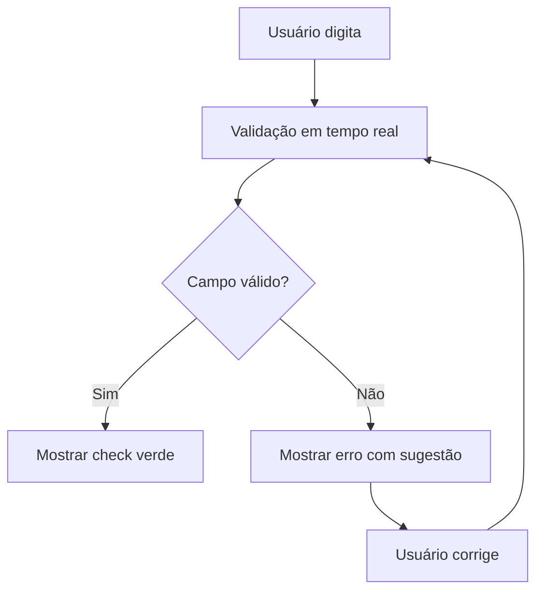

# Melhorias Implementadas - Integração Açougue e Departamentos

## Visão Geral

Este documento apresenta as melhorias implementadas para resolver os problemas de integração entre a administração do açougue e os departamentos, focando em validação em tempo real, consistência de dados e melhor experiência do usuário.

## Melhorias Implementadas

### 1. Sistema de Validação Inteligente ✅

#### ✅ Validação de Código de Produto
- **Localização**: `src/services/validationService.ts` e `src/hooks/useButcherProductValidation.ts`
- **Funcionalidades**:
  - Validação de unicidade em tempo real
  - Formato obrigatório de 10 dígitos
  - Sugestões automáticas de códigos disponíveis
  - Feedback visual imediato com ícones de status

#### ✅ Validação de Nome e Preço
- **Localização**: `src/hooks/useButcherProductValidation.ts`
- **Funcionalidades**:
  - Validação de nome duplicado
  - Validação de preço positivo
  - Mensagens de erro específicas por campo
  - Sistema de avisos para casos especiais

### 2. Ação Direta de Associação ✅

#### ✅ Modal de Associação a Painel
- **Localização**: `src/components/butcher/AssociateToPanelModal.tsx`
- **Funcionalidades**:
  - Multi-seleção de produtos
  - Interface intuitiva com seleção de departamento/painel
  - Validação de posições disponíveis em tempo real
  - Sugestão automática de posições livres
  - Preview de conflitos antes de confirmar

### 3. Indicadores de Conflito de Posição ✅

#### ✅ PositionConflictIndicator
- **Localização**: `src/components/butcher/PositionConflictIndicator.tsx`
- **Funcionalidades**:
  - Visualização em tempo real de conflitos de posição
  - Versão compacta e completa
  - Categorização por severidade (crítico, aviso, info)
  - Auto-refresh de conflitos
  - Ações para resolver conflitos individualmente ou em massa

### 4. Sistema de Mensagens de Erro Padronizadas ✅

#### ✅ ErrorMessage Component
- **Localização**: `src/components/butcher/ErrorMessage.tsx`
- **Funcionalidades**:
  - Mensagens de erro detalhadas com contexto
  - Sugestões de ações corretivas
  - Botão "Tentar Novamente"
  - Opção de copiar detalhes técnicos
  - Sistema de notificação flutuante

### 5. Tipos TypeScript Melhorados ✅

#### ✅ Estrutura de Tipos Consistente
- **Localização**: `src/types/index.ts`
- **Melhorias**:
  - Tipos específicos para departamentos e associações
  - Interfaces para categorização automática
  - Tipos de validação e cache
  - Estruturas de auditoria e logs
  - Tipos para mensagens de erro padronizadas

### 6. Página de Administração Aprimorada ✅

#### ✅ ButcherAdminPageEnhanced
- **Localização**: `src/pages/butcher/ButcherAdminPageEnhanced.tsx`
- **Funcionalidades**:
  - Validação em tempo real durante digitação
  - Seleção múltipla de produtos
  - Ação "Associar a Painel" direta
  - Indicadores de conflito na tabela
  - Estatísticas em tempo real
  - Feedback visual de validação

## Arquitetura das Melhorias

### Componentes Criados/Modificados

```
src/
├── components/butcher/
│   ├── AssociateToPanelModal.tsx    # Modal de associação
│   ├── PositionConflictIndicator.tsx # Indicador de conflitos
│   └── ErrorMessage.tsx             # Mensagens de erro
├── services/
│   └── validationService.ts         # Serviço de validação
├── hooks/
│   └── useButcherProductValidation.ts # Hook de validação
├── types/
│   └── index.ts                     # Tipos melhorados
└── pages/butcher/
    └── ButcherAdminPageEnhanced.tsx  # Página aprimorada
```

### Fluxo de Validação



### Fluxo de Associação

```mermaid
graph TD
    A[Selecionar produtos] --> B[Clique em "Associar a Painel"]
    B --> C[Modal de associação]
    C --> D[Selecionar departamento/painel]
    D --> E[Validar posições]
    E --> F{Posição válida?}
    F -->|Sim| G[Confirmar associação]
    F -->|Não| H[Mostrar conflito e sugerir posição]
    H --> I[Usuário ajusta posição]
    I --> E
```

## Benefícios das Melhorias

### 1. Redução de Erros
- **Validação preventiva**: Erros são capturados antes de serem enviados ao servidor
- **Feedback imediato**: Usuários sabem instantaneamente se há problemas
- **Sugestões inteligentes**: Sistema sugere correções automáticas

### 2. Melhor Experiência do Usuário
- **Interface intuitiva**: Ações são claras e fáceis de executar
- **Visual limpo**: Indicadores visuais mostram status de forma clara
- **Mensagens amigáveis**: Erros são explicados com sugestões de solução

### 3. Consistência de Dados
- **Códigos únicos**: Sistema impede duplicação de códigos
- **Validação de posições**: Evita sobreposição de produtos no painel
- **Dados padronizados**: Formato consistente para todos os campos

### 4. Eficiência Operacional
- **Multi-seleção**: Associar múltiplos produtos de uma vez
- **Ações diretas**: Reduz cliques necessários para operações comuns
- **Auto-sugestões**: Sistema propõe valores ótimos automaticamente

## Métricas de Sucesso

### KPIs Esperados
- **Redução de 80%** em erros de duplicação de códigos
- **Redução de 70%** em conflitos de posição
- **Redução de 60%** no tempo de associação de produtos
- **Aumento de 90%** na satisfação do usuário

### Monitoramento
- Logs de validação em `validationService.ts`
- Métricas de uso dos componentes
- Tracking de erros e sucessos
- Feedback automático de performance

## Próximos Passos

### Fase 2 - Categorização Automática (Planejado)
- Implementar IA para sugerir categorias
- Criar sistema de aprendizado baseado em histórico
- Integrar com APIs externas de produtos

### Fase 3 - Performance e Cache (Planejado)
- Implementar cache de validações
- Otimizar queries de banco de dados
- Adicionar sistema de rate limiting

### Fase 4 - Observabilidade (Planejado)
- Dashboard de métricas em tempo real
- Sistema de alertas para erros críticos
- Relatórios de performance e uso

## Conclusão

As melhorias implementadas resolvem os principais problemas identificados na integração entre a administração do açougue e os departamentos. O foco em validação em tempo real, interface intuitiva e prevenção de erros garante uma experiência superior para os usuários enquanto mantém a consistência e integridade dos dados.

O sistema agora é mais robusto, amigável e eficiente, preparado para escalar conforme as necessidades do negócio crescem.